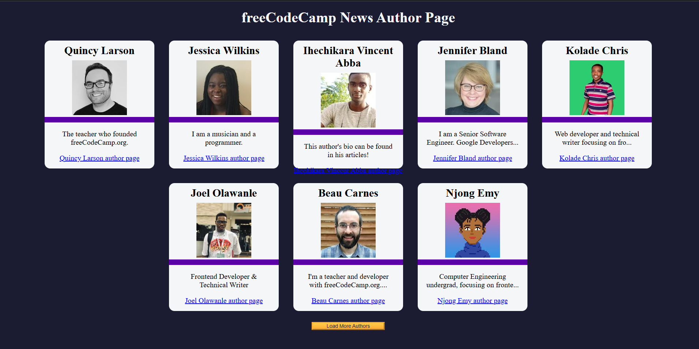

# freeCodeCamp News Author Page

This project is a dynamic web page that displays a list of authors from the freeCodeCamp News platform. It fetches author data from an API and displays it in a card-based layout with an option to load more authors.

## Features

- **Dynamic Data Loading**: Fetches author data from a remote JSON API.
- **Card Layout**: Displays each author's details, including name, image, bio, and a link to their author page.
- **Load More Functionality**: Allows users to load additional authors in batches of eight.
- **Responsive Design**: Adapts to different screen sizes for an optimal viewing experience.

## Getting Started

### Prerequisites

- A web browser that supports modern JavaScript and HTML5.

### Installation

1. Clone the repository or download the project files:
2. Open the index.html file in a web browser.

## How It Works

### Fetching Author Data:
- Fetches data from the API at [https://cdn.freecodecamp.org/curriculum/news-author-page/authors.json](https://cdn.freecodecamp.org/curriculum/news-author-page/authors.json).
- Handles errors gracefully by displaying an error message if the API fails to load.

### Displaying Author Cards:
- Dynamically creates and appends author cards to the page.
- Each card displays:
  - Author's name
  - Avatar
  - A short bio (truncated if over 50 characters)
  - A link to the author's page.

### Load More Functionality:
- Initially displays the first eight authors.
- Loads the next batch of authors when the "Load More Authors" button is clicked.
- Disables the button and shows a "No more data to load" message when all authors are displayed.

## Screenshot of the page

Below is a demo of the fcc author page in action:

